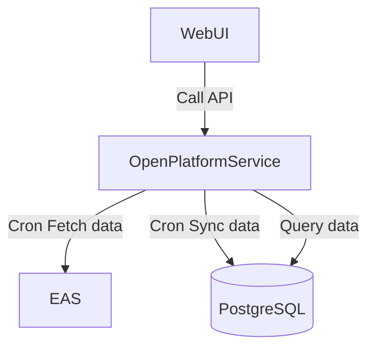

# OpenPlatformService

## Flowchart



## API

```
Req:
GET /v1/claimable-token?wallet=xxx

Resp:
[
  {
    "contractAddress": "xxx1", // projectId == contractAddress ?
    "wallet": "0x123"
    "token": "", // usdt, eth
    "amount": "10.23",
    "status": "",
    "ratio": 20, // 0-100
  },
  {
    "contractAddress": "xxx2", // projectId == contractAddress ?
    "wallet": "0x123"
    "token": "", // usdt, eth
    "amount": "10.23",
    "status": "",
    "ratio": 10, // 0-100
  }
]
```

## FAQ

- 目前主要获取每个 wallet 应该要 claim token 个数 ？只针对 incentive pool 情况么？
- EAS 需要同步的数据主要是有哪些？合约模板？用户数据？
- EAS 跑在 Optimism 链？
- DB ReadOnly Account

```
model IncentivePool {
  id           String                @id
  allocationId String
  projectId    String
  address      String
  creator      String
  timeToClaim  Int
  depositor    String
  wallets      String[]
  details      IncentivePoolDetail[]
  createAt     DateTime              @default(now())
  updatedAt    DateTime              @updatedAt
  deleted      Boolean               @default(false)
}

enum IncentiveCLAIMStatus {
  UNCLAIMED
  CLAIMED
}

model IncentivePoolDetail {
  id        String               @id @default(uuid())
  projectId    String
  poolId    String
  pool      IncentivePool        @relation(fields: [poolId], references: [id])
  token     String
  wallet    String
  amount    String
  ratio     Int
  status    IncentiveCLAIMStatus @default(UNCLAIMED)
  createAt  DateTime             @default(now())
  updatedAt DateTime             @updatedAt
  deleted   Boolean              @default(false)
}

```
